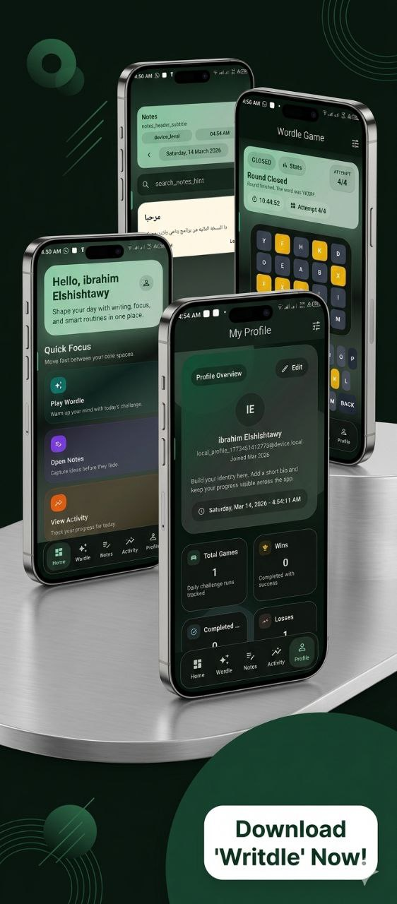

# Writdle V2

**A polished local-first productivity app built with Flutter.**

Notes · Tasks · Wordle Game · Bilingual · Local Notifications · Profile Personalization

 

 

&nbsp;

---

## Overview

**Writdle V2** is a local-first Flutter app built for people who want a clean, fast, and lightweight productivity + gaming experience — no accounts, no cloud friction, just a smooth daily companion on your device.

This version focuses on delivering a production-quality experience:

- Simple device-based profile setup
- Full notes and task management
- Daily Wordle-style gameplay with customizable rules
- Local notifications that work even when the app is closed
- Complete Arabic and English support
- Polished UI with consistent navigation throughout

---

## Features

<table>
  <tr>
    <td valign="top" width="50%">

### 📝 Productivity
- Create and manage **notes** with a clean editor
- Organize **daily tasks** and track progress by date
- Edit your personal local profile

### 🟩 Wordle Game
- Daily Wordle-style gameplay
- Adjustable difficulty and cooldown timing
- Manual restart and competitive layout options
- High contrast mode and gameplay hints

    </td>
    <td valign="top" width="50%">

### 💾 Local Experience
- All data stored locally — no account needed
- Notes, tasks, stats, and profile on-device
- Notifications for daily reminders and task alerts

### 🎨 Personalization
- Light and dark theme support
- Text scaling and reduced motion mode
- Arabic / English language switch

    </td>
  </tr>
</table>

---

## Screens

| Home Dashboard | Wordle Game | Notes | Activity | Settings |
|:-:|:-:|:-:|:-:|:-:|
| ✅ | ✅ | ✅ | ✅ | ✅ |

---

## Tech Stack

| Layer | Technology |
|:--|:--|
| Framework | Flutter + Dart |
| State Management | flutter_bloc |
| Persistence | shared_preferences |
| Notifications | flutter_local_notifications + timezone |
| Localization | intl |
| Calendar | table_calendar |
| Charts | fl_chart |

---

## Download & Install

### Android

> **Requirements:** Android 6.0 (Marshmallow) or higher

1. Tap the **Download APK** button above
2. Open the downloaded `.apk` file on your device
3. If prompted, enable **Install unknown apps** in your settings
4. Install and enjoy ✅

> Writdle V2 is currently available for **Android only**.

---

## Author

**Developed by Ibrahim Elshishtawy**

---

## License

This project is for personal and portfolio use.
You may view the source for reference, but redistribution or commercial use is not permitted without explicit permission.
